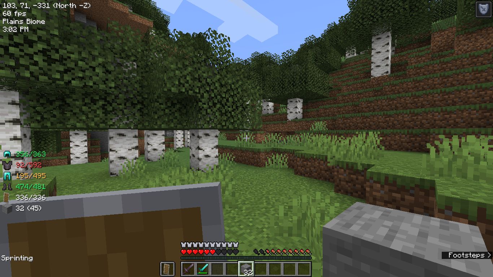
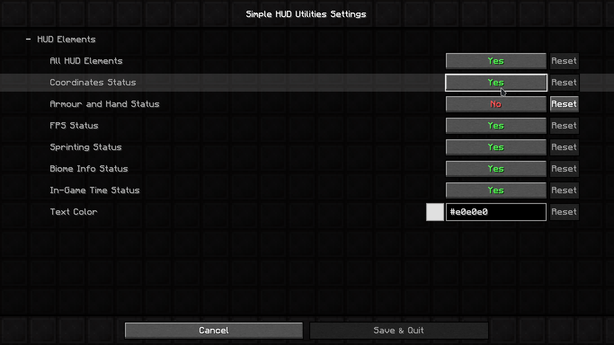

# Simple Utilities Mod (Minecraft 1.15 - 1.20)

Available to download from [Modrinth](https://modrinth.com/mod/simple-hud-utilities) or [Curseforge](https://www.curseforge.com/minecraft/mc-mods/simple-utilities).

Built using the [Fabric Example Mod](https://github.com/FabricMC/fabric-example-mod) and made with the [Fabric](https://fabricmc.net) modding toolchain for Minecraft.

A Minecraft Mod that enhances the Game's HUD with some simple utilities like the following:

- **HUD Features:**
    - Simplified coordinates that are available at all times on the screen (Example: `39, 64, 200` as `X, Y, Z`)
    - Cardinal directions and which Coordinates are increasing/decreasing (Example: `(East X+)` when looking East, where the `X` coordinate is increasing)
    - Current armour and hand items and their durabilities, available at all times on the screen
        - Different colors based on how low the durability is
    - Current Game time in AM/PM format
    - Current sprinting status
    - Current framerate
    - Current Biome the player is on
    - Nether/overworld coordinates conversion
    - Toggle key (editable in Controls screen, default is `k`)
    - Settings page and config file with Mod Menu
        - **Requires [Mod Menu](https://modrinth.com/mod/modmenu) to open settings screen in-game**
        - Config file: `.minecraft/config/simple_utilities.toml` (does not require Mod Menu to edit)

---

## Images

|           In-game HUD                 | Settings page (Requires [Mod Menu](https://modrinth.com/mod/modmenu)) |
| --------------------------------------| ----------------------------------------- |
|  |   |

---

## Installation

- Install [Fabric](https://fabricmc.net/use/).
- Download the latest version of Simple Utilities (in the `.jar` file format) from [GitHub](https://github.com/johnvictorfs/simple-utilities-mod/releases/latest) or from [Modrinth](https://modrinth.com/mod/simple-hud-utilities).
- Move the downloaded file into the `.minecraft/mods` folder.

---

Building from source

- Clone the project with `git clone https://github.com/johnvictorfs/simple-utilities-mod.git`.
- Change to the project's directory with `cd simple-utilities-mod`.
- Run `./gradlew build` to build the mod.
- The built mod will be located in the `build/libs` folder.
    - There will be two files. Use the one without `sources` in the filename.

---

Planned features

- Add configuration to move any specific HUD elements around the screen (drag-and-drop if possible)
- Add option for E counter (entities) and C counter (chunk sections) (possibly M/C counters as well (monsters/creatures)) 
- Add current status effects duration to HUD
- Add Sun/Moon icons to the current game time, so it's easier to tell if the time of day is Day or Night

---

## FAQ

- **Does this Mod work on versions below 1.15?**
    - No. It *might* work on 1.14 with some changes, but cannot work below 1.14, since this mod is made with Fabric, which only supports Minecraft 1.14 and above.

- **Will this Mod get me banned from *(some multiplayer server)*?**
    - It depends on the server you are playing on. This mod runs entirely on the client-side (your computer) and does not support nor require server installation. The mod (mostly) shows things that are accessible through in-game features, such as the F3 Menu. Some features are not directly accessible in the vanilla game, such as very specific game time. Whether these are allowed depends on the server. Do not create issues about this here. Instead, check the rules of the server you intend to use this mod on.

- **Will you add '*(some feature not present in the [Planned Features](#planned-features) section)*'**?
    - Maybe. If it is related to the functionality of this mod, create [an issue](https://github.com/johnvictorfs/simple-utilities-mod/issues/new) about it. I can only add requested features during my spare time, so do not expect a timely response.
